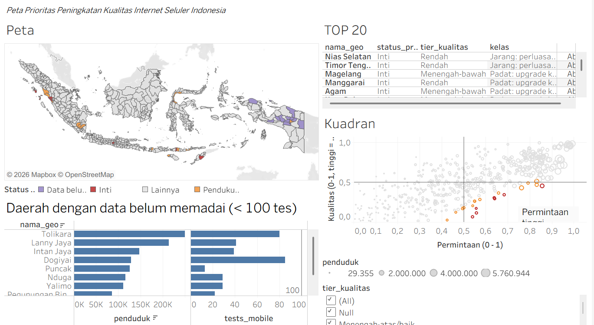

# Peta Prioritas Peningkatan Kualitas Internet Seluler di Indonesia

Kabupaten/kota mana yang permintaannya besar, tetapi kualitas internet selulernya masih rendah?

**[Lihat Story & Dashboard interaktif di Tableau Public](https://public.tableau.com/app/profile/hafiz.fajar.mustafa/viz/PetaPrioritasInternetIndonesia/Story)**



---

## Ringkasan

Saya menilai 514 kabupaten/kota dengan menggabungkan data speed test Ookla (kecepatan dan latensi seluler), proyeksi penduduk BPS, dan batas wilayah. Hasilnya berupa peringkat prioritas peningkatan jaringan, lengkap dengan uji sensitivitas dan daftar daerah yang datanya belum cukup untuk dinilai.

Temuan utama:

- **Tujuh daerah selalu masuk 20 besar** di semua skenario bobot yang diuji: Nias Selatan, Timor Tengah Selatan, Magelang, Manggarai, Agam, Kota Palu, dan Padang Pariaman.
- **Ada dua jenis masalah yang berbeda.** Daerah berkualitas rendah (contoh: Nias Selatan, Timor Tengah Selatan, Manggarai) lebih butuh perbaikan cakupan. Daerah berkualitas menengah tetapi berpenduduk besar (contoh: Magelang, Kota Padang, Lampung Tengah) lebih butuh tambahan kapasitas.
- **Latensi lebih erat kaitannya dengan kepadatan daripada kecepatan unduh.** Korelasi Spearman latensi vs kepadatan -0,77, sedangkan kecepatan unduh vs kepadatan 0,51.
- **12 daerah belum bisa dinilai** karena hasil tesnya kurang dari 100, sebagian besar di Papua pegunungan. Sepuluh yang terbesar dihuni sekitar 1,28 juta jiwa. Ini ditampilkan sebagai kategori tersendiri, bukan disembunyikan.

## Masalah bisnis

Anggaran pengembangan jaringan terbatas, jadi perlu dasar yang jelas untuk menentukan daerah mana yang didahulukan. Proyek ini mencoba menjawabnya dengan data terbuka, sebagai gambaran kondisi pasar. Data ini bukan data internal operator, jadi hasilnya cocok sebagai penyaring awal, bukan keputusan akhir.

## Data

| Data | Sumber | Catatan |
|---|---|---|
| Kecepatan & latensi seluler | [Ookla Open Data](https://registry.opendata.aws/speedtest-global-performance/) | Tile ±600 m, Juli 2025 - Juni 2026 (4 kuartal) |
| Jumlah penduduk | BPS, tabel *Jumlah Penduduk menurut Kabupaten/Kota dan Kelompok Umur* | Tahun 2026 (proyeksi) |
| Batas wilayah | [geoBoundaries](https://www.geoboundaries.org/) | Indonesia ADM2, sumber asli BPS, mewakili tahun 2020 |

Data fixed broadband juga sudah diolah, tetapi dashboard dan indeks saat ini memakai data **seluler** saja.

## Proses

1. **Pengambilan data.** File Ookla diunduh ke laptop, lalu disaring ke wilayah Indonesia dengan DuckDB (kotak batas koordinat, minimal 5 tes per tile). Pengunduhan langsung dari S3 sempat gagal karena *timeout*, jadi diganti dengan unduhan lokal yang bisa dilanjutkan.
2. **SQL di cloud.** Hasil penyaringan diunggah ke BigQuery. *Spatial join* titik tile ke poligon kabupaten/kota dilakukan dengan fungsi geospasial BigQuery, lalu kecepatan dan latensi dirata-ratakan dengan bobot jumlah tes (bukan rata-rata biasa).
3. **Pembersihan.** 514 baris BPS dicocokkan dengan poligon lewat kemiripan nama (`rapidfuzz`) dan dua koreksi manual (Kotabaru, Karangasem). Lima poligon non-administratif (danau, waduk, hutan) dibuang. Luas wilayah dihitung dari poligon dalam proyeksi *equal-area*.
4. **Indeks dan uji sensitivitas.** Lihat bagian Metode.
5. **Visualisasi.** Peta, tabel 20 besar, kuadran, dan halaman metodologi di Tableau Public, disusun menjadi Dashboard dan Story.

Daerah dengan kurang dari 100 tes tidak dimasukkan ke peringkat. Ia ditandai sebagai **data belum memadai**. Uji dengan ambang 50 dan 200 tes menghasilkan 20 besar yang sama, jadi pilihan ambang tidak memengaruhi hasil.

## Metode

Setiap daerah mendapat dua skor, keduanya berbasis peringkat persentil (0-1):

- **Kualitas (Q):** gabungan peringkat kecepatan unduh dan latensi (latensi rendah = baik). Makin tinggi, makin baik.
- **Permintaan (D):** gabungan peringkat jumlah penduduk dan kepadatan.

```
Skor prioritas U = D x (1 - Q)
```

Skor tinggi hanya diperoleh kalau permintaan besar dan kualitas rendah sekaligus. Daerah yang padat tetapi cepat, atau lambat tetapi sepi, tidak otomatis naik.

**Status daerah:**

- **Inti:** masuk 20 besar di ketujuh skenario.
- **Pendukung:** masuk 20 besar di sebagian skenario.
- **Data belum memadai:** kurang dari 100 tes.

**Uji sensitivitas** (tujuh skenario: bobot kecepatan/latensi 50/50, 70/30, 30/70; bobot penduduk/kepadatan 50/50, 70/30, 30/70; ambang tes 50 dan 200):

- Peringkat keseluruhan stabil, dengan korelasi Spearman 0,95-0,97 terhadap skenario dasar.
- Keanggotaan 20 besar lebih sensitif: irisan dengan skenario dasar hanya 11-16 dari 20 saat bobot diubah. Karena itu hasil dipisah menjadi daerah **Inti** dan **Pendukung**, bukan satu daftar yang tampak pasti.

**Kualitas dikelompokkan** menjadi Rendah (Q < 0,25), Menengah-bawah (0,25-0,5), dan Menengah-atas/baik, supaya daerah seperti Magelang (kualitas mendekati median, tetapi penduduknya besar) tidak keliru disebut kurang terlayani.

## Rekomendasi

1. **Perbaikan cakupan dan jaringan penghubung** untuk daerah berkualitas rendah, dimulai dari Nias Selatan, Timor Tengah Selatan, dan Manggarai.
2. **Tambahan kapasitas** untuk daerah padat berkualitas menengah, dimulai dari Magelang, Kota Padang, dan Lampung Tengah.
3. **Kumpulkan data tambahan sebelum memutuskan** di 12 daerah yang datanya belum memadai (survei lapangan atau data internal operator).
4. **Selidiki Jayawijaya.** Latensinya sekitar 263 ms, sekitar delapan kali median nasional. Pola ini konsisten dengan jalur jaringan yang panjang, tetapi ini dugaan yang belum diuji.

## Batasan

- Data mencakup **semua operator**, bukan satu operator saja.
- Data speed test condong ke pengguna aktif dan wilayah perkotaan, sehingga daerah terpencil kurang terwakili.
- Rata-rata dihitung dari rata-rata tile berbobot, bukan median. **Bandingkan peringkat antar daerah, bukan angka kecepatan absolutnya.**
- Titik tile memakai sudut pertama poligon (selisih sekitar 300 m, tidak berpengaruh pada skala kabupaten/kota).
- Daya beli (misalnya PDRB per kapita) belum masuk indeks, jadi permintaan baru diwakili penduduk dan kepadatan.
- Periode data tidak seragam: batas wilayah mewakili tahun 2020, penduduk 2026 (proyeksi), dan Ookla Juli 2025 - Juni 2026. Perubahan wilayah administratif setelah 2020, kalau ada, tidak tercermin di peta.
- Beberapa kuartal digabung menjadi satu, jadi tren waktu tidak dianalisis.
- Rata-rata di satu kabupaten bisa didominasi tile di kota kabupatennya.

## Cara menjalankan ulang

Butuh Python 3.12+ dan akun BigQuery (mode *sandbox* cukup).

```bash
pip install duckdb pandas geopandas pyarrow rapidfuzz matplotlib
```

Berkas besar tidak disertakan di repo (`raw/`, `data/*.parquet`, `data/idn_adm2.geojson`). Unduh batas wilayah ADM2 Indonesia dari geoBoundaries dan simpan sebagai `data/idn_adm2.geojson`.

Urutan:

1. `python filter_ookla2.py` : unduh dan saring data Ookla ke `data/id_mobile.parquet` dan `data/id_fixed.parquet`
2. `python cek.py` : cek berkas hasil
3. `python luas.py` dan `python batas.py` : luas wilayah dan batas untuk BigQuery
4. `python rapikan_bps.py` : rapikan data BPS
5. Unggah berkas ke BigQuery (dataset `telco`), lalu jalankan `sql/01` sampai `sql/04`. Ekspor hasilnya ke `data/kab_speed_flag.csv`
6. `python cocokkan_final.py` : gabungkan BPS, luas, dan kecepatan
7. `python indeks.py` : EDA, indeks, dan uji sensitivitas
8. `python cek_top20.py` : 20 besar dan jumlah skenario
9. `python finalisasi.py` : label kualitas dan status prioritas
10. `python siapkan_peta.py` : berkas peta untuk Tableau

## Struktur repo

```
telco-internet-gap/
├── data/    # data hasil olahan (CSV, GeoJSON ringan)
├── sql/     # query BigQuery (01-05)
├── img/     # grafik EDA dan tangkapan layar dashboard
├── *.py     # skrip pipeline
└── README.md
```

## Pengembangan berikutnya

- Menambahkan PDRB per kapita ke komponen permintaan.
- Menguji hipotesis latensi (misalnya sebaran latensi per tile di Jayawijaya).
- Menambahkan analisis spasial (misalnya Moran's I) untuk melihat klaster daerah berkualitas rendah.
- Membandingkan hasil dengan data internal operator.

## Sumber dan atribusi

- **Kecepatan dan latensi:** Speedtest® by Ookla® Global Fixed and Mobile Network Performance Maps, berdasarkan analisis Ookla atas data Speedtest Intelligence®, Juli 2025 - Juni 2026. Disediakan oleh Ookla, diakses Oktober 2026. Lisensi CC BY-NC-SA 4.0.
- **Batas wilayah:** geoBoundaries (gbOpen), Indonesia ADM2. Sumber asli: Badan Pusat Statistik (BPS), World Food Programme, dan OCHA ROAP, mewakili tahun 2020. Lisensi: Creative Commons Attribution 3.0 IGO (CC BY 3.0 IGO). Geometri disederhanakan untuk visualisasi. Rujukan: Runfola dkk. (2020), "geoBoundaries: A global database of political administrative boundaries", PLOS ONE 15(4): e0231866.
- **Jumlah penduduk:** Badan Pusat Statistik (BPS), tabel *Jumlah Penduduk menurut Kabupaten/Kota dan Kelompok Umur*, 2026.

**Lisensi hasil olahan:** data hasil olahan di folder `data/` dibagikan dengan lisensi CC BY-NC-SA 4.0 karena merupakan turunan dari data Ookla, hanya untuk keperluan non-komersial. Kode (`*.py`, `sql/`) berlisensi MIT.

Proyek ini tidak didukung atau disahkan oleh Ookla, BPS, WFP, maupun OCHA.

## Penulis

Hafiz Fajar Mustafa. Mahasiswa fisika tingkat akhir.
Kontak: [isi LinkedIn atau email]
